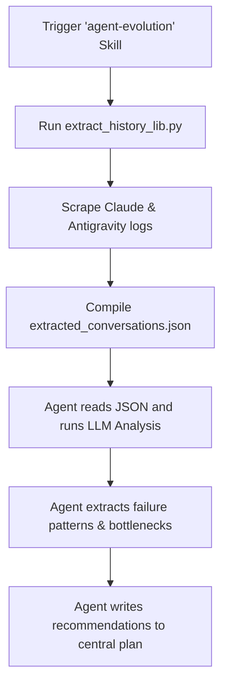

# 🔄 Agent Evolution Hub & Custom Skill

A cohesive, double-agent log analyzer and local tuning cockpit designed for **Claude Code** and **Google Antigravity**. 

This repository compiles developer conversation logs, identifies recurring failure loops (e.g. path confusion, user interruptions), and empowers autonomous agents to dynamically synthesize new customizations, rules (`AGENTS.md`), and custom skills.

---

## 🚀 Key Features

*   **Dual Log Scraper**: Unified extraction of Claude Code projects (`~/.claude/projects/`) and Antigravity cache sessions (`~/.gemini/tmp/`).
*   **Sleek Dev Workspace**: Minimalist light-themed cockpit built with **FastAPI** & **Next.js (Tailwind CSS v4 + TypeScript)**.
*   **Dynamic Customization Stager**: View detailed model thinking processes, run NLP diagnostics, edit and install rules or skills directly to target directories in a single click.
*   **Self-Contained Custom Skill**: Standard-compliant customization manifest (`SKILL.md`) that lets agents self-diagnose and write their own behavioral guardrails.

---

## 📦 Directory Structure

```
.
├── .agents/
│   └── skills/
│       └── agent-evolution/               # The Reusable Custom Skill Folder
│           ├── SKILL.md                # Agent Skill Manifest
│           └── scripts/
│               ├── extract_history_lib.py
│               └── test_extract_history_lib.py
├── frontend/                           # Next.js Web Application
├── main.py                             # FastAPI Web Server (Port 8080)
├── run_app.py                          # Unified Dev Server Launcher
├── test_main.py                        # Backend API Pytest Suite
└── README.md                           # This Guide
```

---

## 🛠️ Getting Started & Local Setup

### Prerequisites
*   Ensure **Python 3.13+**, **NodeJS**, and **uv** (fast Python package installer) are installed:
    ```bash
    uv --version
    npm --version
    ```
> [!NOTE]
> **Zero-Dependency Core Extractor**: The core extraction library ([extract_history_lib.py](.agents/skills/agent-evolution/scripts/extract_history_lib.py)) uses **only** built-in Python standard modules (`json`, `pathlib`, `glob`, etc.). It runs directly on any clean Python 3 machine without needing `uv` or any `pip` package installation. `uv` is only required to host the Next.js/FastAPI Web Hub locally.


### 1. Launch the Cockpit Console
Run the unified python launcher script to start both dev servers concurrently:
```bash
uv run python run_app.py
```
This launches:
*   **FastAPI Backend Server**: `http://localhost:8080` (API Docs: `/docs`)
*   **Next.js Frontend Client**: `http://localhost:3000`

---

## 🤖 Using as an Autonomous Agent Skill

This workspace is fully structured as a reusable **Custom Skill**. When you run an agent in this project (or import this skill into other folders), the agent detects the manifest and parses log histories programmatically.

### Triggering the Skill in Chat
To command the agent to tune its own rules using this skill, type:
> *"Run the `agent-evolution` skill to analyze my past logs and update the custom rules for `/Users/username/workspace/target-project`"*

### Agent Instruction Manual (`SKILL.md`)
The skill directs the agent through the following flow:



1.  **Extract**: Run the python parser script to compile the database.
2.  **Ingest**: Open `extracted/extracted_conversations.json` to load past turns.
3.  **Inspect**: Check for path mistakes (e.g. failing to find `backend/agent.py`), repetitive loops, and interruptions.
4.  **Stage**: Write recommended rules and skills into `extracted/agent_evolution_plan.md` and present them to the user.

---

## 🧪 Running Tests

Ensure all parsers and API routers are correct by running the `pytest` test suite:
```bash
uv run pytest
```
*Tests verify user caveats scrubbing, Antigravity protobuf structure parsing, and FastAPI file-writing operations.*
